# 🏗️ Namma Ooru Smart Solutions - Complete Website Blueprint

> **Last Updated:** February 2, 2026  
> **Version:** 1.0  
> **Project Type:** E-commerce Platform for Smart Home Solutions

---

## 📋 Table of Contents

1. [Site Overview](#site-overview)
2. [Site Architecture](#site-architecture)
3. [Page Breakdown](#page-breakdown)
4. [Component Library](#component-library)
5. [User Flows](#user-flows)
6. [Product Catalog Structure](#product-catalog-structure)
7. [Technical Stack](#technical-stack)
8. [Data Structures](#data-structures)
9. [Design System](#design-system)
10. [Future Enhancements](#future-enhancements)

---

## 🌐 Site Overview

**Namma Ooru Smart Solutions** is a single-page e-commerce application (SPA) for selling smart home products including water purifiers, inverters, solar solutions, cameras, and robotic vacuum cleaners.

### Key Features
- ✅ Single-page application with smooth scrolling navigation
- ✅ Product catalog with 7 categories and 20+ products
- ✅ Shopping cart with checkout flow
- ✅ Invoice generation system
- ✅ Bilingual support (English/Tamil)
- ✅ WhatsApp integration
- ✅ Contact form
- ✅ Responsive design (Mobile-first)

---

## 🏛️ Site Architecture


---

## 📄 Page Breakdown

### 1️⃣ Main Home Page (Single Page Application)

**Route:** `/` (default)  
**File:** [App.jsx](file:///d:/Jitesh%20Projects/final%20project/namma%20ooru%20smart%20-%20Copy/src/App.jsx)

#### Sections (in order):

| Section | Component | Purpose | Scroll ID |
|---------|-----------|---------|-----------|
| **Navigation** | `Navbar` | Site navigation, cart access, menu | - |
| **Hero** | `Hero` | Main landing section with CTA | `#home` |
| **Trust Stats** | `TrustStats` | Social proof (customers, products, ratings) | - |
| **Products** | Product Grid | Filterable product catalog | `#products` |
| **Services** | `Services` | Express delivery information | `#services` |
| **Mission** | `Mission` | Company mission statement | `#mission` |
| **Brands** | `BrandsStrip` | Partner brands showcase | - |
| **Contact** | `ContactSection` | Contact form and info | `#contact` |
| **Footer** | `Footer` | Links, copyright, social media | - |

#### Interactive Overlays:
- **Cart Drawer** - Slides from right
- **Product Detail Modal** - Centered overlay
- **WhatsApp Float Button** - Fixed bottom-right

---

### 2️⃣ Invoice Page

**Route:** Conditional render (not URL-based)  
**File:** [Bill.jsx](file:///d:/Jitesh%20Projects/final%20project/namma%20ooru%20smart%20-%20Copy/src/components/Bill.jsx)

**Trigger:** After checkout from cart drawer  
**Features:**
- Customer information display
- Itemized cart breakdown
- Total calculation
- PDF download functionality
- Return to home button

---

## 🧩 Component Library

### Navigation Components

#### 1. **Navbar**
**File:** [Navbar.jsx](file:///d:/Jitesh%20Projects/final%20project/namma%20ooru%20smart%20-%20Copy/src/components/Navbar.jsx)

```mermaid
graph LR
    A[Navbar] --> B[Logo/Brand Name]
    A --> C[Navigation Links]
    A --> D[Cart Icon + Count]
    A --> E[Mobile Menu Toggle]
    
    B --> B1[Bilingual: NAMMA OORU / நம்ம ஊரு]
    C --> C1[Home]
    C --> C2[Products]
    C --> C3[Services]
    C --> C4[Contact]
    D --> D1[Shopping Cart Badge]
    E --> E1[Hamburger Icon]
    
    style A fill:#4CAF50
    style B fill:#81C784
```



**Features:**
- Sticky on scroll with background change
- Bilingual brand name (auto-switches every 2s)
- Cart count badge
- Smooth scroll navigation
- Mobile responsive hamburger menu

---

#### 2. **Footer**
**File:** [Footer.jsx](file:///d:/Jitesh%20Projects/final%20project/namma%20ooru%20smart%20-%20Copy/src/components/Footer.jsx)

**Sections:**
- Company information
- Quick links
- Contact details
- Social media links
- Copyright notice

---

### Content Components

#### 3. **Hero**
**File:** [Hero.jsx](file:///d:/Jitesh%20Projects/final%20project/namma%20ooru%20smart%20-%20Copy/src/components/Hero.jsx)

**Elements:**
- Full-screen hero image (responsive: `home.webp` / `home-m.webp`)
- Main headline
- Subheadline
- CTA buttons (Explore Products, Contact Us)
- Gradient overlay for text readability

---

#### 4. **TrustStats**
**File:** [TrustStats.jsx](file:///d:/Jitesh%20Projects/final%20project/namma%20ooru%20smart%20-%20Copy/src/components/TrustStats.jsx)

**Displays:**
- Number of happy customers
- Products available
- Average rating
- Years in business

**Design:** Animated counters with icons

---

#### 5. **ProductCard**
**File:** [ProductCard.jsx](file:///d:/Jitesh%20Projects/final%20project/namma%20ooru%20smart%20-%20Copy/src/components/ProductCard.jsx)


**Features:**
- Image with hover zoom effect
- Category badge overlay
- Product name (2-line clamp)
- Price display
- Quick add-to-cart button
- Click to open detail modal

---

#### 6. **ProductDetailModal**
**File:** [ProductDetailModal.jsx](file:///d:/Jitesh%20Projects/final%20project/namma%20ooru%20smart%20-%20Copy/src/components/ProductDetailModal.jsx)

**Displays:**
- Image gallery (multiple images)
- Product name
- Category
- Price, MRP, Savings
- Full description
- Features list
- Specifications table
- Badges
- Rating and review count
- Add to cart button
- Close button

---

#### 7. **Services**
**File:** [Services.jsx](file:///d:/Jitesh%20Projects/final%20project/namma%20ooru%20smart%20-%20Copy/src/components/Services.jsx)

**Content:**
- Express delivery information
- Service highlights
- Delivery timeline
- Coverage areas

---

#### 8. **Mission**
**File:** [Mission.jsx](file:///d:/Jitesh%20Projects/final%20project/namma%20ooru%20smart%20-%20Copy/src/components/Mission.jsx)

**Content:**
- Company mission statement
- Vision and values
- Commitment to customers

---

#### 9. **BrandsStrip**
**File:** [BrandsStrip.jsx](file:///d:/Jitesh%20Projects/final%20project/namma%20ooru%20smart%20-%20Copy/src/components/BrandsStrip.jsx)

**Features:**
- Horizontal scrolling brand logos
- Partner brands showcase
- Auto-scroll animation (optional)

---

#### 10. **ContactSection**
**File:** [ContactSection.jsx](file:///d:/Jitesh%20Projects/final%20project/namma%20ooru%20smart%20-%20Copy/src/components/ContactSection.jsx)

**Includes:**
- `ContactForm` component
- Contact information (phone, email, address)
- Business hours
- Map integration (optional)

---

#### 11. **ContactForm**
**File:** [ContactForm.jsx](file:///d:/Jitesh%20Projects/final%20project/namma%20ooru%20smart%20-%20Copy/src/components/ContactForm.jsx)

**Fields:**
- Name
- Email
- Phone
- Message
- Submit button

**Validation:** Client-side form validation

---

### Interactive Components

#### 12. **CartDrawer**
**File:** [CartDrawer.jsx](file:///d:/Jitesh%20Projects/final%20project/namma%20ooru%20smart%20-%20Copy/src/components/CartDrawer.jsx)


**Features:**
- Slide-in from right animation
- Cart item management
  - Increase/decrease quantity
  - Direct quantity input
  - Remove item
- Real-time total calculation
- Customer details form (on checkout)
- Proceed to invoice generation

---

#### 13. **WhatsAppFloat**
**File:** [WhatsAppFloat.jsx](file:///d:/Jitesh%20Projects/final%20project/namma%20ooru%20smart%20-%20Copy/src/components/WhatsAppFloat.jsx)

**Features:**
- Fixed position (bottom-right)
- WhatsApp icon
- Cart count badge
- Click to open cart drawer
- Pulse animation

---

#### 14. **Bill (Invoice)**
**File:** [Bill.jsx](file:///d:/Jitesh%20Projects/final%20project/namma%20ooru%20smart%20-%20Copy/src/components/Bill.jsx)

**Sections:**
- Company header
- Customer information
- Invoice number and date
- Itemized product list
- Subtotal, tax, total
- Terms and conditions
- Download PDF button
- Back to home button

---

#### 15. **SectionTitle**
**File:** [SectionTitle.jsx](file:///d:/Jitesh%20Projects/final%20project/namma%20ooru%20smart%20-%20Copy/src/components/SectionTitle.jsx)

**Props:**
- `title` - Main heading
- `subtitle` - Supporting text

**Usage:** Consistent section headers throughout the site

---

## 🔄 User Flows

### Flow 1: Browse and Purchase


---

### Flow 2: Contact Inquiry


---

### Flow 3: Quick Cart Access via WhatsApp Button


---

## 📦 Product Catalog Structure

### Product Categories (7 Total)

| Category | Count | Price Range | File Path |
|----------|-------|-------------|-----------|
| **Water Purifier** | 5 | ₹17,000 - ₹31,500 | `/ASSETS/Water_Purifier_a/` |
| **Water Softener** | 2 | ₹56,500 - ₹59,500 | `/ASSETS/Water_Softener_b/` |
| **Inverter & Battery** | 3 | ₹20,500 - ₹22,500 | `/ASSETS/Inverter_Battery/` |
| **Heat Pump Water Heater** | 1 | ₹65,000 | `/logo.png` (placeholder) |
| **Solar Water Heater** | 2 | Contact for Price | `/logo.png` (placeholder) |
| **Camera** | 4 | ₹2,999 - ₹27,750 | `/ASSETS/Solar camera/` |
| **Robotic Vacuum Cleaner** | 2 | ₹28,500 - ₹38,500 | `/ASSETS/Robotics_c/`, `/ASSETS/Robotics_d/` |

**Total Products:** 19

---

### Product Data Structure

**File:** [products.js](file:///d:/Jitesh%20Projects/final%20project/namma%20ooru%20smart%20-%20Copy/public/products.js)

```javascript
{
    id: 'unique-product-id',           // Unique identifier
    name: 'Product Name',              // Display name
    category: CATEGORIES.CATEGORY_NAME, // Category constant
    price: '₹20,000',                  // Selling price
    mrp: '₹25,000',                    // Original price
    savings: '₹5,000',                 // Discount amount
    description: 'Full description',   // Multi-line description
    image: '/ASSETS/path/image.webp',  // Main image
    images: ['img1.webp', 'img2.webp'], // Gallery images
    features: ['Feature 1', 'Feature 2'], // Key features
    specifications: {                  // Technical specs
        Capacity: '10L',
        Warranty: '1 Year'
    },
    badges: ['Bestseller', 'New'],     // Product badges
    rating: 4.5,                       // Star rating (0-5)
    reviewCount: 120                   // Number of reviews
}
```

---

### Featured Products

#### Top Sellers:
1. **Aquaguard Aspire Nova RO+UV 2X** - ₹22,000 (120 reviews, 4.5★)
2. **Robotic Vacuum with Auto Bin** - ₹38,500 (42 reviews, 4.8★)
3. **1050 UPS & 150Ah Battery Exide** - ₹22,500 (30 reviews, 4.8★)

---

## 🛠️ Technical Stack

### Frontend Framework
- **React 18** - Component-based UI
- **Vite** - Build tool and dev server
- **Framer Motion** - Animations
- **Lucide React** - Icon library

### Styling
- **Tailwind CSS** - Utility-first CSS framework
- **PostCSS** - CSS processing
- **Custom CSS** - [index.css](file:///d:/Jitesh%20Projects/final%20project/namma%20ooru%20smart%20-%20Copy/src/index.css)

### State Management
- **React Context API** - Toast notifications
- **React Hooks** - Local state management
  - `useState` - Component state
  - `useEffect` - Side effects
  - `useCallback` - Memoized callbacks
  - `useMemo` - Memoized values
  - `useContext` - Context consumption

### Routing
- **Single Page Application** - No router library
- **Smooth Scroll Navigation** - Hash-based section navigation
- **Conditional Rendering** - Page switching (Home ↔ Invoice)

### Performance Optimizations
- **Lazy Loading** - Components loaded on demand
- **Code Splitting** - Separate bundles for heavy components
- **Image Optimization** - WebP format, responsive images
- **Memoization** - `memo`, `useMemo`, `useCallback`

### Build & Deployment
- **Vite** - Development and production builds
- **Vercel** - Deployment platform (configured via `vercel.json`)
- **Service Worker** - PWA capabilities (`sw.js`)

---

## 📊 Data Structures

### Cart Item Structure
```javascript
{
    id: 'product-id',
    name: 'Product Name',
    price: '₹20,000',
    image: '/path/to/image.webp',
    quantity: 2,
    // ... other product fields
}
```

### Customer Information Structure
```javascript
{
    name: 'Customer Name',
    phone: '9876543210',
    email: 'customer@example.com',
    address: 'Full Address'
}
```

### Toast Notification Structure
```javascript
{
    id: 1675234567890,  // Timestamp
    message: 'Product added to cart!',
    type: 'success' | 'error'
}
```

---

## 🎨 Design System

### Color Palette

| Color | Hex | Usage |
|-------|-----|-------|
| **Primary** | `#1e293b` (slate-900) | Buttons, navbar, text |
| **Success** | `#4CAF50` (green-600) | CTA, success states |
| **Background** | `#FFFFFF` (white) | Page background |
| **Text Primary** | `#0f172a` (slate-900) | Headings, body text |
| **Text Secondary** | `#64748b` (slate-500) | Supporting text |
| **Border** | `#e2e8f0` (slate-200) | Card borders, dividers |

### Typography

**Font Families:**
- **Headings:** Outfit (800, 900 weight)
- **Body:** Poppins (300, 400, 500, 600, 700)
- **Brand (English):** Catamaran (700, 900)
- **Brand (Tamil):** Noto Sans Tamil (700, 900)

**Font Sizes:**
- Hero Title: `text-5xl` to `text-7xl`
- Section Titles: `text-3xl` to `text-4xl`
- Product Names: `text-sm` to `text-base`
- Body Text: `text-sm` to `text-base`

### Spacing
- Section Padding: `py-12` to `py-20`
- Container Max Width: `max-w-7xl`
- Grid Gaps: `gap-4` to `gap-6`

### Border Radius
- Cards: `rounded-3xl`
- Buttons: `rounded-lg` to `rounded-xl`
- Badges: `rounded-full`

### Shadows
- Cards: `shadow-md` hover `shadow-xl`
- Modals: `shadow-2xl`
- Buttons: `shadow-lg`

### Animations

**Framer Motion Variants:**
- Fade In: `opacity: 0 → 1`
- Scale: `scale: 0.9 → 1`
- Slide In: `x: -100 → 0`

**Transitions:**
- Default: `duration-200` to `duration-300`
- Hover Effects: `transition-all`
- Image Zoom: `duration-500`

---

## 🚀 Future Enhancements

### Phase 1: User Experience
- [ ] Product search functionality
- [ ] Wishlist feature
- [ ] Product comparison tool
- [ ] Customer reviews and ratings system
- [ ] Product recommendations

### Phase 2: E-commerce Features
- [ ] Payment gateway integration
- [ ] Order tracking system
- [ ] User accounts and authentication
- [ ] Order history
- [ ] Multiple delivery addresses

### Phase 3: Marketing
- [ ] Blog section
- [ ] Promotional banners
- [ ] Coupon/discount codes
- [ ] Email newsletter signup
- [ ] Social media integration

### Phase 4: Admin Panel
- [ ] Product management (CRUD)
- [ ] Order management
- [ ] Customer management
- [ ] Analytics dashboard
- [ ] Inventory tracking

### Phase 5: Advanced Features
- [ ] Multi-language support (beyond EN/TA)
- [ ] Live chat support
- [ ] AR product preview
- [ ] Voice search
- [ ] Progressive Web App (PWA) enhancements

---

## 📱 Responsive Breakpoints

| Breakpoint | Width | Target Devices |
|------------|-------|----------------|
| **Mobile** | < 768px | Phones |
| **Tablet** | 768px - 1024px | Tablets |
| **Desktop** | > 1024px | Laptops, Desktops |
| **Large Desktop** | > 1280px | Large screens |

### Responsive Behavior

**Navigation:**
- Mobile: Hamburger menu
- Desktop: Horizontal nav links

**Product Grid:**
- Mobile: 2 columns
- Tablet: 3 columns
- Desktop: 5-6 columns

**Hero:**
- Mobile: `home-m.webp` (optimized)
- Desktop: `home.webp` (full resolution)

---

## 🔗 Key File Paths

### Core Files
- **Entry Point:** [index.html](file:///d:/Jitesh%20Projects/final%20project/namma%20ooru%20smart%20-%20Copy/index.html)
- **Main JS:** [main.jsx](file:///d:/Jitesh%20Projects/final%20project/namma%20ooru%20smart%20-%20Copy/src/main.jsx)
- **App Root:** [App.jsx](file:///d:/Jitesh%20Projects/final%20project/namma%20ooru%20smart%20-%20Copy/src/App.jsx)
- **Global Styles:** [index.css](file:///d:/Jitesh%20Projects/final%20project/namma%20ooru%20smart%20-%20Copy/src/index.css)

### Configuration
- **Vite Config:** [vite.config.js](file:///d:/Jitesh%20Projects/final%20project/namma%20ooru%20smart%20-%20Copy/vite.config.js)
- **Tailwind Config:** [tailwind.config.js](file:///d:/Jitesh%20Projects/final%20project/namma%20ooru%20smart%20-%20Copy/tailwind.config.js)
- **PostCSS Config:** [postcss.config.js](file:///d:/Jitesh%20Projects/final%20project/namma%20ooru%20smart%20-%20Copy/postcss.config.js)
- **Vercel Config:** [vercel.json](file:///d:/Jitesh%20Projects/final%20project/namma%20ooru%20smart%20-%20Copy/vercel.json)

### Data
- **Products:** [products.js](file:///d:/Jitesh%20Projects/final%20project/namma%20ooru%20smart%20-%20Copy/public/products.js)

---

## 📞 Contact & Support

For questions about this blueprint or the website:
- **Project Location:** `d:\Jitesh Projects\final project\namma ooru smart - Copy`
- **Documentation:** This file

---

**Blueprint Created:** February 2, 2026  
**Status:** ✅ Complete and Production-Ready
